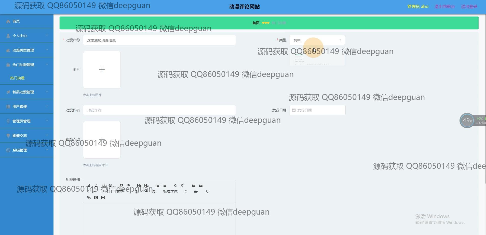

<h1 align="center">的动漫评论网站vue</h1>

## 简介
动漫评论网站：角色分为管理员、用户；功能包括动漫类型管理、用户管理、评论管理、帖子编辑、视频播放和个性化信息管理。    --计算机毕业设计源码；毕设源码；java毕业设计源码

## 联系方式

<h3 align="center">获取完整代码与数据库文件 + 微信：deepguan QQ: 86050149 QQ群: 783742310</h3>

<h3 align="center">可帮忙远程部署 包运行成功！提供远程部署、修改代码、设计文档指导、代码讲解等服务！</h3>

## 功能介绍（完整见运行截图）
管理员：基本功能包括登录和退出。管理界面提供了对动漫类型管理、热门动漫管理、新品动漫管理，以及用户和管理员管理的功能。管理员可以添加或编辑动漫信息，管理评论内容，还可以通过导航栏访问个人中心、系统管理和剧集交流等模块。界面设计注重简洁和功能模块的清晰分布。

用户：基本功能包括登录和注册，访问首页后，可通过主导航栏切换到热门动漫、新品动漫、剧情交流等页面。用户可以在个人中心查看和编辑自己的信息，包括用户名、密码、联系信息等，上传个人头像。用户还能够在动漫详情页面观看视频、查看相关信息，并参与评论和话题交流，网站提供便捷的动漫搜索和内容分类功能，提升用户体验。

访客：可以自由浏览网站的首页，通过导航栏选项访问热门动漫、新品动漫、剧情交流等模块。网站首页展示动漫作品的图片和简介，并提供评论功能，访客可以查看已有评论和动漫详情。虽然没有编辑权限，但访客能够通过直观的界面设计全面了解网站提供的动漫信息和社区交流机会，为访问者提供良好的观看和参与体验。

## 运行截图

本代码来源于网络,仅供学习参考使用!

